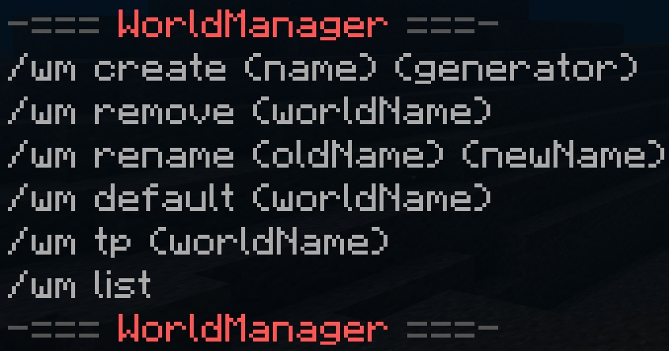

<!-- PROJECT LOGO -->
 

  

<h3 align="center">WorldManager</h3>

  

    Ein simpler Welten Manager mit den wichtigsten Funktionen!
     
  

<!-- ABOUT THE PROJECT -->
## Commands

  

(<a href="#readme-top">back to top</a>)

<!-- ROADMAP -->
## TODO

- [ ] Feature 1
- [ ] Feature 2
- [ ] Feature 3
    - [ ] Nested Feature

(<a href="#readme-top">back to top</a>)

## Credits

<a href="https://www.flaticon.com/free-icons/world" title="world icons">World icons created by Freepik - Flaticon</a>

(<a href="#readme-top">back to top</a>)

